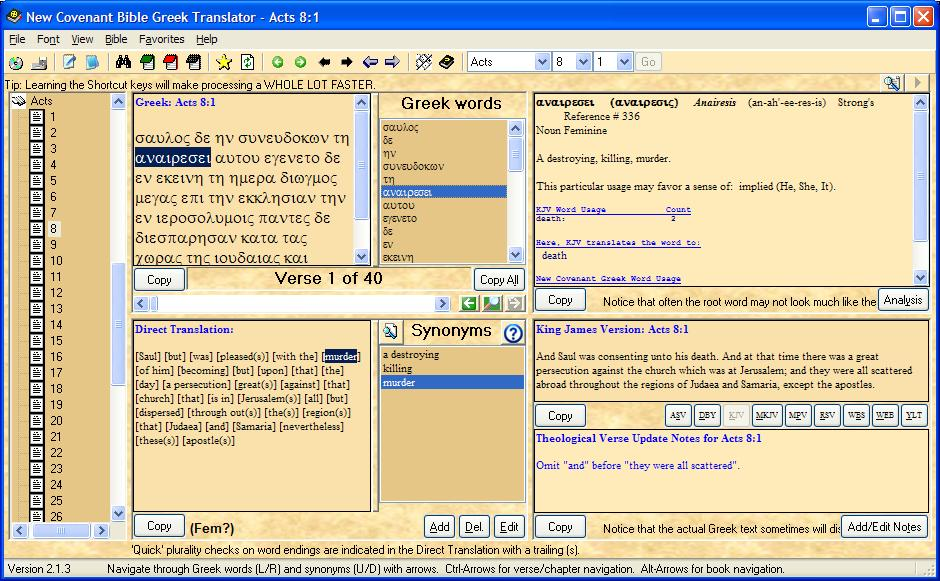



## New Covenant Bible Greek Translator 2\.1\.4

### Description

Version 2.1.4. Inspired men may have written the Good Book, but they did not write it in English. Quickly become a Biblical Scholar, and be the local resident expert on ancient Christian history, its Bible, and its Greek translation. Read the Christian Bible DIRECTLY from the best rendition of the original Greek text reconstructed from the oldest verified Greek texts yet found. Use a professional-quality interface that is LOADED with options, designed for fast and easy use by both serious Bible students and those who are simply curious. Comparison Bibles available: King James Version (1611), Modern King James Version (1962), Darby (1884), Young's Literal Translation (1898), the Revised Standard Version (1971), World English Bible (1907), Webster's (1833), and American Standard Version (1901). New and enhanced reference databases are included to get really anal about translation and understanding terms. Scan each Greek verse word-by-word, apply valid English synonyms, and reconstruct your very own personalized version of this great book. Find out what it REALLY says. The program comes complete with full, detailed definitions of every Greek word, Theological notes on almost 7000 corrections to older translations, and lots of help and expansive reference tables. It will even perform plurality checking and gender checking on words for you. The application is loaded with tons of really cool programming tricks and features, and the source code is packed with comments. 112 more Theological verse corrections notes to the KJV have been added with 2.0. Another 1245 have been added with 2.1. New Features since version 1.0: Add Personal Notes to verses, scan through notes, read all notes, a completely new database has been added that is based upon the Vine Concise Bible Dictionary of the Bible, Dictionary Search, instant reference notification, Synonym word-list reordering, synonym explorer, more background themes (plus customized backgrounds), panel resizing, additional formatting options for saving bible (with a built-in bible-viewer and annotator), improved Gender and plurality checking on Greek words, Quick find of personal notes, Quick find of verses with Theological Correction Notes, and "Vapor Verses" (verse that did not exist in the original texts -- or sometimes ever!), and more. New Features since version 2.0: New stand-alone Bible viewer. Now when you have saved a Bible file (from the "Write Complete Bible File" under the Bible menu, you can use this mini-application to view it without having to start up the main program). Additionally, a Text Search feature has been added to both viewers. Another new much-requested feature is that you can now have the Theological Notes written out at the end of each chapter of the Bible File. Plus, another 1244 Theological Correction Notes were added that specifically address redefinitions of word meanings over the centuries. A new section was also added to the main help file that compares 284 common examples of KJV word usage differing greatly with (and sometimes contradicting) the word's modern usage. An auto-playing demonstration has also been added to visually teach new users how to use this application. A KJV Bible Dictionary is included, comparing 1300+ KJV terms with their equivalent modern interpretations (the results will surprise you). More help, more data, more details, more features, more everything! So much new data has been added that the ZIP file has grown from its original 5 MB to 16 MB. Version 2.1 fixes all reported bugs in Version 1.x.x and 2.0.x, and all requested enhancements have been added. Version 2.1.3 Added almost 400 more words to the KJV dictionary, bringing the total to over 1700, and added a feature to automatically point these terms out in the Verse text, providing their definitions as you view each verse. A new dialog allowing you to explore the original KJV translation strategy was also provided. Version 2.1.4 Fixed a few tiny errors.
 
### More Info
 

             |
---                |---
**Submitted On**   |2007-04-07 20:04:34
**By**             |[David Ross Goben](https://github.com/Planet-Source-Code/PSCIndex/blob/master/ByAuthor/david-ross-goben.md)
**Level**          |Advanced
**User Rating**    |4.5 (89 globes from 20 users)
**Compatibility**  |VB 6\.0
**Category**       |[Complete Applications](https://github.com/Planet-Source-Code/PSCIndex/blob/master/ByCategory/complete-applications__1-27.md)
**World**          |[Visual Basic](https://github.com/Planet-Source-Code/PSCIndex/blob/master/ByWorld/visual-basic.md)
**Archive File**   |[New\_Covena205895472007\.zip](https://github.com/Planet-Source-Code/david-ross-goben-new-covenant-bible-greek-translator-2-1-4__1-65588/archive/master.zip)

